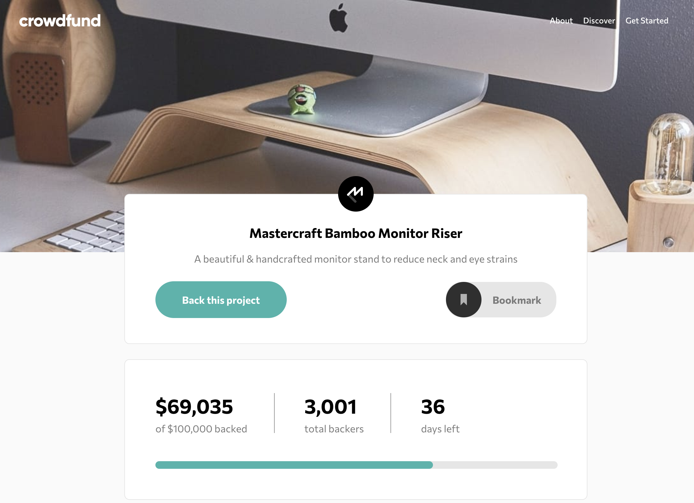
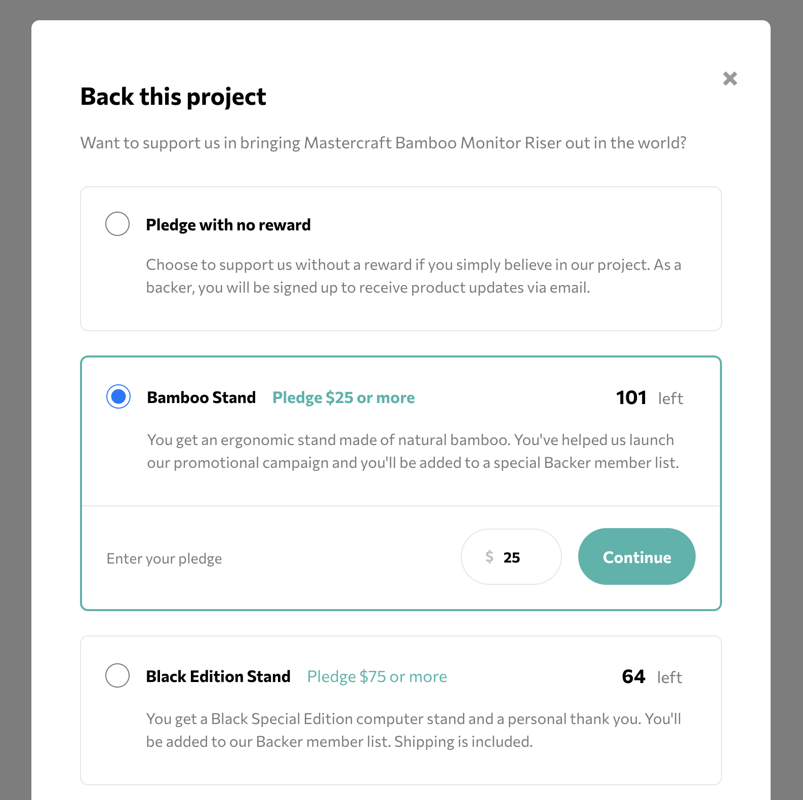
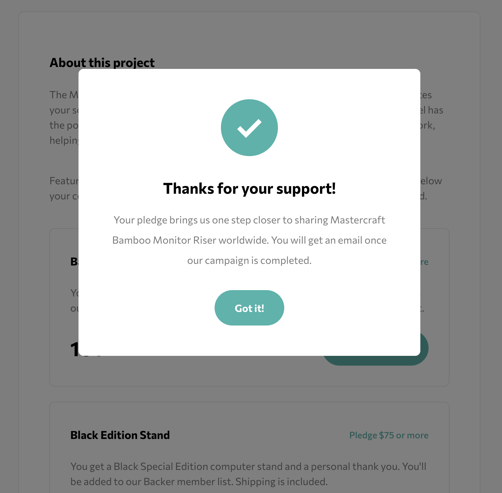
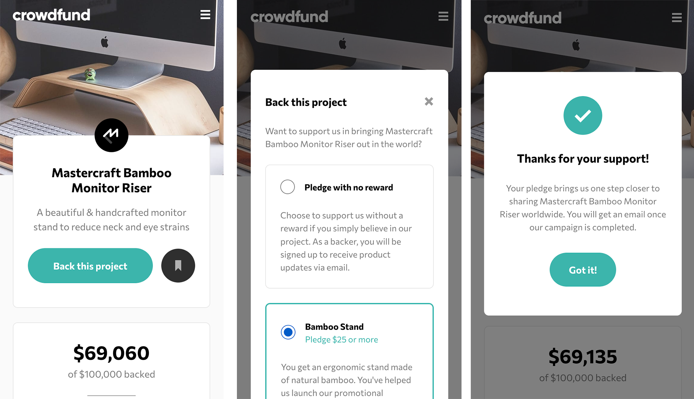

# Frontend Mentor - Crowdfunding product page solution

This is a solution to the [Crowdfunding product page challenge on Frontend Mentor](https://www.frontendmentor.io/challenges/crowdfunding-product-page-7uvcZe7ZR). Frontend Mentor challenges help you improve your coding skills by building realistic projects.

## Table of contents

  - [Overview](#overview)
    - [The challenge](#the-challenge)
    - [Screenshot](#screenshot)
    - [Links](#links)
  - [My process](#my-process)
    - [Built with](#built-with)
    - [What I learned](#what-i-learned)
    - [Continued development](#continued-development)
  - [Author](#author)

## Overview

### The challenge

Users should be able to:

- View the optimal layout depending on their device's screen size
- See hover states for interactive elements
- Make a selection of which pledge to make
- See an updated progress bar and total money raised based on their pledge total after confirming a pledge
- See the number of total backers increment by one after confirming a pledge
- Toggle whether or not the product is bookmarked

### Screenshot

Desktop :

Mobile :

### Links

- Live Site URL: [https://crowdfunding-product-page-candyfair.vercel.app/](https://crowdfunding-product-page-candyfair.vercel.app/)

## My process

I started by setting up a React environment with Redux. Working from the Figma design files, I first identified each component, I structured them and I styled them, using a main styling SCSS file for general and recurrent styles, and an individual SCSS file for each component as needed. For this part, I styled for mobile first. Once the styling was over, I coded each interaction using Redux  with a store, different states, actions and reducers. I then deployed the web app on [Vercel](https://vercel.com).

### Built with

- Semantic HTML5 markup
- SASS/SCSS
- Flexbox
- Mobile-first workflow
- React + Redux
- Controlled inputs

### What I learned

This challenge really helped me to understand the basic functionning of Redux, and the logic between the store, the state, actions and reducers.

I also enjoyed implementing JSON files to store the data, and import it in the web app through the props.

### Continued development

As of June 2022, this challenge is not completely finished and I'm still working on it. I'd like to add an option to scroll the homepage back to its top after validating the pledge. It would be nice to have some animations too when the gauge and amounts are updating.

I also plan to add local storage so the last amounts get memorized into the user's browser. And later I will replace this by linking the web app to a database - rather than keeping the data into JSON files - so the amounts will be the same for all users.

## Author

- Website - [Candice Fairand Web Dev Portfolio](https://www.candicefairand.com)
- Frontend Mentor - [@Candyfair](https://www.frontendmentor.io/profile/Candyfair)
- Twitter - [@candy_fair](https://twitter.com/candy_fair)
